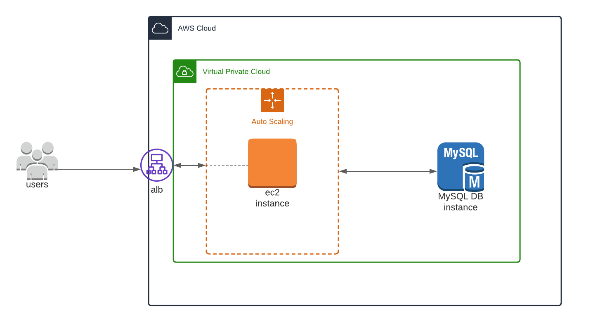

# sp-devops-base
This repository is used to setup core infrastructure resources to deploy a wordpress application with persistent storage.

The following resources will be provisioned by this repository:

* vpc
* asg
* rds
* alb (load balancer)
* sg (security groups)

## Architecture

## Build/Deploy Infrastructure Resources

To run this repository you will need the following:

1. AWS Iam Role Credentials set. You can do this by following the guide https://docs.aws.amazon.com/cli/latest/userguide/cli-configure-envvars.html

2. Set environment variables in terraform.tfvars file

3. Install terraform. https://learn.hashicorp.com/tutorials/terraform/install-cli

Once you've setup the prerequisite steps above, you will need to run the terraform cmds

`terraform init`

`terraform plan`

`terraform apply`

## Next Steps

1. Add a route 53 resource

2. Enable Cloudwatch logs

3. Create a acm certificate to serve traffic over 443